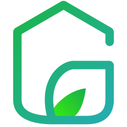
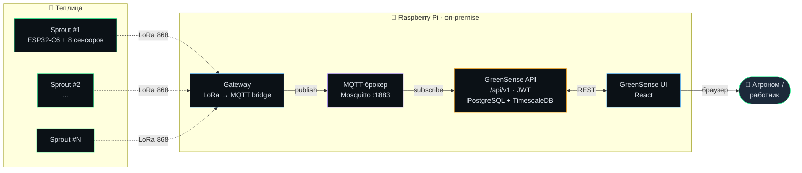

<!--
  GreenSense — GitHub organisation profile README.
  Lives in jim-greenhouse/.github/profile/README.md
  Rendered automatically at https://github.com/jim-greenhouse
-->

  

  <h1>GreenSense</h1>

  

    <b>Локальная IoT-платформа для&nbsp;промышленных теплиц</b> 
    Автономные устройства <code>Sprout</code> на&nbsp;ESP32-C6 + LoRa&nbsp;868&nbsp;МГц · real-time телеметрия · рекомендации агроному · автоматические задачи для&nbsp;работников
  

  

    
    
    
    
  

  

    
    
    
    
    
    
  

---

## 🌱 О&nbsp;продукте

**GreenSense** — это законченная IoT-платформа для&nbsp;тепличных хозяйств, которая решает три задачи разом:

1. **Видит, что происходит в&nbsp;каждом секторе** — каждые 60 секунд снимает 8 метрик с&nbsp;воздуха, почвы, света и&nbsp;CO₂.
2. **Подсказывает агроному, что делать** — рекомендации с&nbsp;обоснованием, основанные на&nbsp;фазе роста культуры и&nbsp;истории метрик.
3. **Распределяет работу команде** — автоматические задачи для&nbsp;работников с&nbsp;приоритетом и&nbsp;дедлайном.

Главное отличие от&nbsp;«облачных коробок» — **всё работает локально**. Серверная стойка на&nbsp;Raspberry&nbsp;Pi рядом с&nbsp;теплицей хранит данные, обслуживает интерфейс и&nbsp;принимает LoRa-пакеты. Интернет нужен только если вы&nbsp;сами захотите удалённый доступ.

---

## 🛰️ Sprout — наше устройство

<table>
  <tr>
    <td width="50%" valign="top">
      

        <b>Sprout</b> — это автономный аппаратный узел, который мы&nbsp;разработали специально для&nbsp;этой платформы. Один компактный IP65-корпус, который ставится прямо в&nbsp;грядке, содержит:
      

      <ul>
        <li><b>8 сенсоров</b> на&nbsp;борту: <code>BME280</code> (температура&nbsp;/ влажность&nbsp;/ давление), <code>SCD41</code> (CO₂), <code>TSL2591</code> (свет), <code>DS18B20</code> (температура почвы), <code>PH-4502C</code> (pH), <code>EC&nbsp;Gravity</code> (электропроводность), <code>Soil&nbsp;V1.2</code> (влажность почвы).</li>
        <li><b>FireBeetle&nbsp;2 ESP32-C6</b> — RISC-V&nbsp;160&nbsp;МГц с&nbsp;deep-sleep.</li>
        <li><b>LoRa&nbsp;868&nbsp;МГц</b>, дальность до&nbsp;5&nbsp;км в&nbsp;поле.</li>
        <li><b>Li-Po 5000&nbsp;мАч + солнечная панель</b> — автономность до&nbsp;30 дней без&nbsp;зарядки.</li>
        <li><b>OLED-дисплей</b> с&nbsp;живыми показаниями.</li>
      </ul>
      

        В&nbsp;API, базе данных и&nbsp;спецификациях Sprout проходит как <code>MetricCollectorDevice</code> — это его техническое имя. Для&nbsp;пользователей мы&nbsp;везде говорим «Sprout».
      

    </td>
    <td width="50%" valign="top" align="center">
      <pre style="display:inline-block; text-align:left; font-size:11px;">
┌──────────────────────────────┐
│ ☀  SOLAR 6V · 10W            │
├──────────────────────────────┤
│ ┌────────────┐  ┌──────────┐ │
│ │ OLED       │  │ ESP32-C6 │ │
│ │ SP-1024    │  │ FireBeetle│ │
│ │ T 23.4°C   │  └──────────┘ │
│ │ RH 68%     │  ┌────┬────┐  │
│ │ CO₂ 1024   │  │BME │SCD │  │
│ └────────────┘  │280 │41  │  │
│ ┌──────────┐    └────┴────┘  │
│ │ LoRa     │    ┌──────────┐ │
│ │ 868 MHz  │    │ TSL2591  │ │
│ └──────────┘    └──────────┘ │
│ 🔋 Li-Po 5000 mAh · 3.7V     │
│ ● ● ● ● ●                    │
│ soil  T°  pH  EC  UV         │
└──────────────────────────────┘
      </pre>
    </td>
  </tr>
</table>

---

## 🏗️ Архитектура

Четыре сервиса, развёрнутых локально на&nbsp;одной Raspberry&nbsp;Pi:

> **MQTT-брокер** в&nbsp;этой архитектуре нужен для&nbsp;развязки приёма пакетов от&nbsp;их&nbsp;хранения — Gateway может работать и&nbsp;при&nbsp;кратковременной недоступности API, накапливая пакеты в&nbsp;брокере.

---

## 🚀 Демо

Откройте интерактивную демо-версию web-app в&nbsp;браузере. Полностью рабочее приложение с&nbsp;mock-данными: создавайте теплицы и&nbsp;секторы, смотрите gauge'и и&nbsp;графики, выполняйте задачи, редактируйте шаблоны культур.

  

---

## 📦 Репозитории

| Репозиторий | Назначение | Стек |
|---|---|---|
| [`web-app`](https://github.com/jim-greenhouse/web-app) | Веб-интерфейс GreenSense UI — пользовательский фронтенд платформы | React 18 · TypeScript · Vite · Tailwind · TanStack Query · Recharts |
| [`landing`](https://github.com/jim-greenhouse/landing) | Маркетинговый сайт [green-sense.ru](https://green-sense.ru) | Vite · vanilla JS · GSAP |
| [`api`](https://github.com/jim-greenhouse/api) | GreenSense API — REST `/api/v1`, авторизация, бизнес-логика | _(closed-source / Go / PostgreSQL + TimescaleDB)_ |
| [`gateway`](https://github.com/jim-greenhouse/gateway) | Локальный шлюз: LoRa → MQTT-bridge на&nbsp;Raspberry&nbsp;Pi | _(closed-source / Rust)_ |
| [`firmware`](https://github.com/jim-greenhouse/firmware) | Прошивка устройств Sprout (MetricCollectorDevice) | C++ · PlatformIO · ESP-IDF · Arduino-LoRa |
| [`hardware`](https://github.com/jim-greenhouse/hardware) | Схемы и&nbsp;PCB для&nbsp;Sprout, BOM, корпуса | KiCad · STEP |
| [`spec`](https://github.com/jim-greenhouse/spec) | OpenAPI + AsyncAPI спецификации платформы | YAML · OpenAPI 3.1 |

---

## 🧰 Технологический стек

<table>
  <tr>
    <th>Слой</th>
    <th>Технологии</th>
  </tr>
  <tr>
    <td><b>Фронтенд</b></td>
    <td>
      
      
      
      
      
      
      
    </td>
  </tr>
  <tr>
    <td><b>Бэкенд</b></td>
    <td>
      
      
      
      
    </td>
  </tr>
  <tr>
    <td><b>Хранилище</b></td>
    <td>
      
      
    </td>
  </tr>
  <tr>
    <td><b>Железо</b></td>
    <td>
      
      
      
      
    </td>
  </tr>
  <tr>
    <td><b>Сенсоры</b></td>
    <td>
      
      
      
      
      
      
    </td>
  </tr>
</table>

---

## 📐 Метрики и&nbsp;единицы измерения

На&nbsp;каждом Sprout мы&nbsp;снимаем **14 типов метрик**, объединённых в&nbsp;четыре группы:

<table>
<tr><th>Группа</th><th>Метрика</th><th>Ед.</th><th>Норма</th><th>Источник</th></tr>
<tr><td rowspan="5"><b>🌬️ Атмосфера</b></td>
  <td><code>AIR_TEMPERATURE</code></td><td>°C</td><td>18–28</td><td>BME280</td></tr>
<tr><td><code>AIR_HUMIDITY</code></td><td>%</td><td>55–85</td><td>BME280</td></tr>
<tr><td><code>ATMOSPHERIC_PRESSURE</code></td><td>hPa</td><td>980–1030</td><td>BME280</td></tr>
<tr><td><code>VPD</code></td><td>kPa</td><td>0.4–1.4</td><td>расчётно</td></tr>
<tr><td><code>CO2_CONCENTRATION</code></td><td>ppm</td><td>400–1500</td><td>SCD41</td></tr>

<tr><td rowspan="2"><b>☀️ Свет</b></td>
  <td><code>LIGHT_LUX</code></td><td>lx</td><td>5k–50k</td><td>TSL2591</td></tr>
<tr><td><code>UV_INDEX</code></td><td>—</td><td>0–10</td><td>SI1145</td></tr>

<tr><td rowspan="4"><b>🌱 Почва</b></td>
  <td><code>SOIL_MOISTURE</code></td><td>%</td><td>30–80</td><td>Soil V1.2</td></tr>
<tr><td><code>SOIL_TEMPERATURE</code></td><td>°C</td><td>16–26</td><td>DS18B20</td></tr>
<tr><td><code>SOIL_PH</code></td><td>pH</td><td>5.5–7.5</td><td>PH-4502C</td></tr>
<tr><td><code>SOIL_EC</code></td><td>mS/cm</td><td>1.2–3.5</td><td>EC Gravity</td></tr>

<tr><td rowspan="3"><b>🔋 Sprout-узел</b></td>
  <td><code>BATTERY_LEVEL_PERCENT</code></td><td>%</td><td>&gt;&nbsp;20</td><td>внутр.</td></tr>
<tr><td><code>LORA_RSSI</code></td><td>dBm</td><td>&gt;&nbsp;−90</td><td>LoRa</td></tr>
<tr><td><code>LORA_SNR</code></td><td>dB</td><td>&gt;&nbsp;0</td><td>LoRa</td></tr>
</table>

---

## 👥 Кто&nbsp;и&nbsp;что видит

GreenSense рассчитан на&nbsp;три рабочих места. Каждая роль видит свой набор экранов и&nbsp;действий — без&nbsp;«перегруза» функциями, которые конкретному человеку не&nbsp;нужны.

| Роль | Что делает в&nbsp;системе |
|---|---|
| 👑 **OWNER** | Полный доступ. Управление организацией, передача владения. |
| ⚙️ **ADMIN** | Создание/удаление теплиц, регистрация Sprout-узлов, пользователи, инфраструктура. |
| 🌿 **AGRONOMIST** | Управление секторами и&nbsp;фазами роста, шаблоны культур, приём рекомендаций, аналитика телеметрии. |
| 🧤 **WORKER** | Канбан задач, выполнение поручений, комментарии. |

---

## 📚 Документация

- **Архитектура и&nbsp;API** — [`jim-greenhouse/spec`](https://github.com/jim-greenhouse/spec): `openapi-webapi.yaml`, `openapi-gateway.yaml`, `asyncapi-mqtt.yaml`
- **Пользовательская документация** — встроена в&nbsp;интерфейс: [demo.green-sense.ru/docs](https://demo.green-sense.ru/docs) (22 раздела: обучение, оборудование, метрики, FAQ)
- **Руководство по&nbsp;развёртыванию** — [`api`](https://github.com/jim-greenhouse/api) → `docs/deployment.md`
- **Прошивка Sprout** — [`firmware`](https://github.com/jim-greenhouse/firmware) → `README.md`

---

## 🤝 Связь

| | |
|---|---|
| 📧 Email | [info@green-sense.ru](mailto:info@green-sense.ru) |
| 📞 Телефон | [+7 (987) 420-58-33](tel:+79874205833) |
| 💬 Telegram | [@GreenSense_Manager](https://t.me/GreenSense_Manager) |
| 🌐 Сайт | [green-sense.ru](https://green-sense.ru) |
| ▶️ Демо | [demo.green-sense.ru](https://demo.green-sense.ru) |

---

**Сделано в&nbsp;Казани, с любовью&nbsp;к зелени.**

© 2026 GreenSense. Все права защищены.

